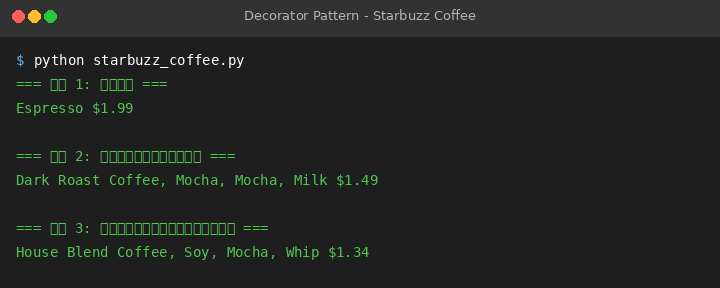

# 装饰器模式（Decorator）- 星巴兹咖啡

## 模式原理

### 意图
dynamic地给一个对象添加一些额外的职责。就增加功能来说，Decorator模式相比生成子类更为灵活。

### 适用场景
- 在不影响其他对象的情况下，以动态、透明的方式给单个对象添加职责
- 处理那些可以撤消的职责
- 当不能采用生成子类的方法进行扩充时。一种情况是，可能有大量独立的扩展，为支持每一种组合将产生大量的子类，使得子类数目呈爆炸性增长。另一种情况可能是因为类定义被隐藏，或类定义不能用于生成子类

### 关键参与者
- **Component（组件）**：定义一个对象接口，可以给这些对象动态地添加职责
- **ConcreteComponent（具体组件）**：定义一个对象，可以给这个对象添加一些职责
- **Decorator（装饰者）**：维持一个指向Component对象的指针，并定义一个与Component接口一致的接口
- **ConcreteDecorator（具体装饰者）**：向组件添加职责

## 示例故事

本示例采用经典的"星巴兹咖啡"场景：
- 不同类型的咖啡（Espresso、HouseBlend）作为基础组件
- 不同的调料（Milk、Mocha、Soy）作为装饰者
- 可以动态组合咖啡和调料

对应关系：
- `Beverage` → Component（饮料组件）
- `Espresso`、`HouseBlend` → ConcreteComponent（具体饮料）
- `CondimentDecorator` → Decorator（调料装饰者）
- `Milk`、`Mocha`、`Soy` → ConcreteDecorator（具体调料）

## 运行说明

### 环境要求
- Python 3.10+

### 运行方式
```bash
python starbuzz_coffee.py
```

### 预期输出
```
=== 订单 1: 浓缩咖啡 ===
Espresso $1.99
=== 订单 2: 深焙咖啡，双倍摩卡，加奶 ===
House Blend Coffee, Mocha, Mocha, Milk $1.49
=== 订单 3: 综合咖啡，加豆浆，加摩卡，加奶泡 ===
House Blend Coffee, Soy, Mocha, Whip $1.34
```

## 运行截图

